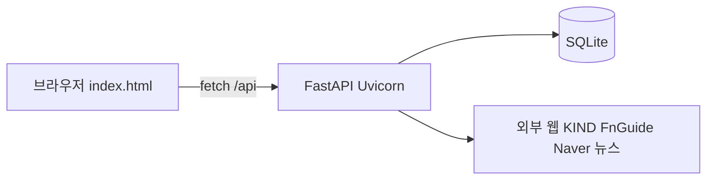

# kr-analyze 기술 스택·기능 정리

이 문서는 저장소에 **실제로 포함된 코드·설정**을 기준으로 정리했습니다. (`requirements.txt`, `app/`, `scripts/`, `app/web/`)

---

## 1. 개요

| 구분 | 사용 여부 |
|------|-----------|
| 백엔드 | Python + **FastAPI** + **Uvicorn** |
| DB | **SQLite** (`data.sqlite3`) |
| ORM | **SQLModel** (내부적으로 **SQLAlchemy**) |
| 프론트엔드 | **React 18** + **TypeScript**, 소스 `frontend/` |
| 프론트 빌드 | **Vite 5** — 산출물 `app/web/dist/` (없으면 `/`에 빌드 안내 HTML만 제공) |

> 성능과 안정성을 위한 최적화 이력은 별도 문서로 계속 관리하고 있습니다.

---

## 2. 언어·런타임

- **Python 3** (타입 힌트 `from __future__ import annotations` 등 사용)
- 표준 라이브러리: `argparse`, `asyncio` 컨텍스트(`lifespan`), `pathlib`, `json`, `re`, `threading`, `concurrent.futures`, `datetime`, `uuid` 등

---

## 3. 웹 서버·API 프레임워크

### FastAPI

- 앱 진입점: `app/main.py`
- **라이프사이클**: `lifespan`에서 스케줄러 기동·종료
- **라우팅**: `app/api.py`의 `APIRouter(prefix="/api")`를 메인 앱에 `include_router`
- **응답**: JSON API + 루트 `/`는 **`app/web/dist/`가 있으면** `StaticFiles(..., html=True)`로 **React 빌드** 서빙, **없으면** 빌드 안내 HTML을 `HTMLResponse`로 반환

### Uvicorn

- `requirements.txt`: `uvicorn[standard]` — ASGI 서버(개발 시 `--reload` 등)

### FastAPI에서 쓰는 기능 (코드 기준)

- `APIRouter`, `HTTPException`
- `HTMLResponse`, `StaticFiles` (프로덕션 SPA)
- 엔드포인트: GET/POST 위주 REST 스타일

### Pydantic

- `fastapi`/`sqlmodel`이 내부적으로 사용. 앱 코드에서 pydantic 모델을 직접 많이 쓰지는 않을 수 있으나, **의존성 체인상 포함** (`requirements.txt`에 명시)

---

## 4. 데이터 저장·ORM

### SQLite

- 파일: 프로젝트 루트 `data.sqlite3`
- 엔진: `sqlmodel.create_engine("sqlite:///...")`
- 연결 옵션: `check_same_thread=False`
- **WAL 등 pragma**: `db.py`에서 `journal_mode=WAL`, `synchronous=NORMAL`, `busy_timeout` 적용
- **가벼운 마이그레이션**: `sqlite3`로 `PRAGMA table_info` 후 `ALTER TABLE`·인덱스 생성

### SQLModel

- 모델: `app/models.py` — `Company`, `Snapshot`
- 세션: `Session(engine)`, `select`, `col`, `func` 등

### SQLAlchemy

- SQLModel과 함께 사용
- `api.py` 등에서 **`sqlalchemy.text`로 Raw SQL** (윈도우 함수 `ROW_NUMBER` 등) 실행

---

## 5. HTTP 클라이언트·HTML 파싱

### httpx

- 동기 `Client` 위주 (타임아웃·연결 풀 설정)
- 외부 페이지 요청, API 호출, 오류 시 `httpx.HTTPError` 처리

### BeautifulSoup4 (`bs4`)

- HTML 파싱

### lxml

- BeautifulSoup 파서로 **`"lxml"`** 지정 (`naver.py`, `fnguide.py`, `kind.py`, `news.py` 등)

### openpyxl

- `requirements.txt`에 **포함되어 있으나**, 현재 코드베이스에서는 **import/사용처 없음** (예비 의존성이거나 과거 잔여일 수 있음)

---

## 6. 스케줄링·백그라운드 작업

### APScheduler

- `BackgroundScheduler`, `timezone="Asia/Seoul"`
- **cron** 작업 예: 월요일 상장사 목록 갱신, 매일 컨센서스 벌크 갱신 (`app/services/scheduler.py`)

### Python 동시성·스레딩 (앱 로직)

- `threading.Thread`, `Lock`
- `concurrent.futures.ThreadPoolExecutor` — 벌크 채우기 등 (`app/services/bulk.py`)

---

## 7. 비즈니스·데이터 수집 모듈 (`app/services/`)

| 모듈 | 역할 (요약) |
|------|-------------|
| `calc.py` | 적정주가·괴리율 계산 |
| `fnguide.py` | FnGuide 페이지 **스크래핑** (httpx + BeautifulSoup + lxml) |
| `naver.py` | 네이버 금융 등 **현재가** 조회 |
| `kind.py` | **KIND** 상장법인 목록(엑셀/HTML 등) 처리·파싱 |
| `jobs.py` | 종목/스냅샷 갱신 오케스트레이션 |
| `bulk.py` | 대량 채우기 작업·job id 상태 관리 |
| `news.py` | 뉴스 HTML 가져오기·키워드/감성 휴리스틱·유사 그룹핑 |
| `scheduler.py` | APScheduler 작업 등록 |

외부 **공개 REST “SDK”** 형태는 아니고, **사이트/HTML 기반 수집**이 중심입니다.

---

## 8. 프론트엔드 (`frontend/` → `app/web/dist/`)

- **스택**: **Vite 5** + **React 18** + **TypeScript**
- **스타일**: 전역 `App.css` (기존 바닐라 테마·반응형 규칙 이식)
- **개발**: `npm run dev` — Vite가 `/api`, `/health`를 `127.0.0.1:8000`으로 **프록시**
- **배포 빌드**: `npm run build` → 출력 디렉터리 `app/web/dist/` (저장소 `.gitignore`; 호스팅 전 빌드 필요)
- **UI 기능**: 검색 디바운스, 표 정렬(서버/클라이언트), 페이지네이션, 연도 선택, 고급 갱신·벌크 API, 상위 5 뉴스

**폴백**: `app/web/dist/`가 없을 때 `/`는 API용 빌드 안내만 표시 (`/api`는 동작)

---

## 9. HTTP API 엔드포인트 요약 (`/api`)

| 메서드 | 경로 | 용도 |
|--------|------|------|
| GET | `/` | 대시보드 HTML |
| GET | `/health` | 헬스 체크 JSON |
| GET | `/api/rows` | 표 데이터(검색·정렬·페이지) |
| GET | `/api/top5-news` | 괴리율 상위 뉴스 |
| POST | `/api/admin/refresh/companies` | 상장사 목록 갱신 |
| POST | `/api/admin/refresh/snapshot/{ticker}` | 단일 스냅샷 |
| POST | `/api/admin/refresh/snapshot_by_query` | 검색어 기준 스냅샷 |
| POST | `/api/admin/refresh/price_by_query` | 현재가만 |
| POST | `/api/admin/refresh/consensus_by_query` | 컨센서스만 |
| POST | `/api/admin/refresh/snapshots` | 다종목 스냅샷 |
| POST | `/api/admin/refresh/visible` | 화면 관련 갱신 등 |
| POST | `/api/admin/refresh/price_visible` | 현재가 벌크(표시 기준) |
| POST | `/api/admin/fill`, `fill_price`, `fill_consensus` | 백그라운드 대량 채우기 |
| GET | `/api/admin/fill/{job_id}` | 벌크 job 상태 |

(실제 파라미터·동작은 `app/api.py` 참고)

---

## 10. CLI·스크립트

- `scripts/refresh.py`: `argparse`로 `--companies`, `--ticker`, `--snapshots`, `--limit` 등 — 로컬에서 갱신 작업 실행

---

## 11. 프로젝트 메타·도구

- **Git**: 버전 관리 (`.gitignore`에 `.venv`, SQLite 파일, `__pycache__` 등)
- **가상환경**: README에서 `python -m venv .venv` 권장
- **패키지 설치**: `pip install -r requirements.txt`
- **에디터**: `.gitignore`에 `.vscode/` (팀 로컬 설정용)

Docker, Kubernetes, GitHub Actions 등 **CI/CD 설정 파일은 이 저장소 기준으로는 없음**.

---

## 12. `requirements.txt` 의존성 한눈에

| 패키지 | 역할 |
|--------|------|
| fastapi | 웹 API 프레임워크 |
| uvicorn[standard] | ASGI 서버 |
| httpx | HTTP 클라이언트 |
| beautifulsoup4 | HTML 파싱 |
| lxml | BS4 파서 백엔드 |
| openpyxl | **현재 코드 미사용** (선언만 됨) |
| pydantic | 검증·모델 (FastAPI/SQLModel과 연동) |
| sqlmodel | ORM + 모델 |
| apscheduler | 크론형 백그라운드 작업 |

---

## 13. 다이어그램 (데이터 흐름 요약)

---

## 14. 문서 유지보수

- 의존성·구조가 바뀌면 `requirements.txt`, `README.md`, 본 문서를 함께 갱신하는 것이 좋습니다.
- 프론트 스택을 바꾸면 §7·§8·§12를 같이 갱신하세요.
